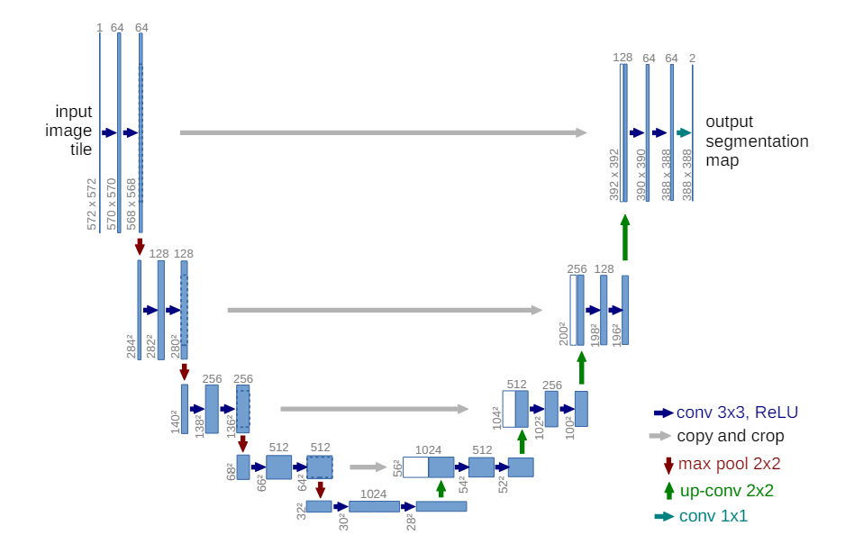
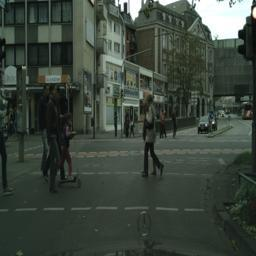
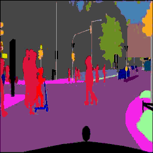

# Semantic-Segmentation-Using-U-Net

## Overview
This project is inspired by the paper available at <https://arxiv.org/abs/1505.04597>, which originally focused on Semantic Segmentation for the ISBI Cell Tracking Challenges in 2015. In this implementation, I have implemented the U-Net model from scratch using PyTorch, trained and tested on the Cityscapes image pair dataset 

## Model Architecture

## Input Image

## Output Image

